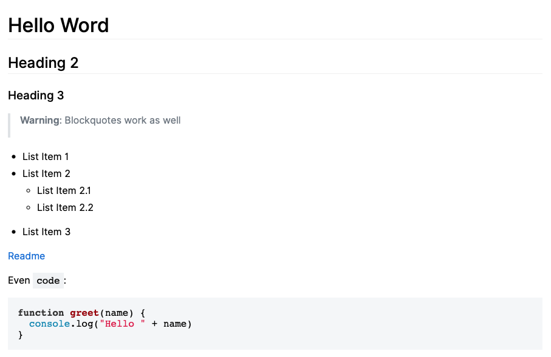

# react-markdown-github-renderers

A set of [react-markdown](https://www.github.com/rexxars/react-markdown) renderers that implement the visual appearance of GitHub's Markdown renderers.<br>
It uses [highlight](http://highlightjs.org) to provide syntax highlighting for supported every language.

## Support Me
If you're using [Robin Frischmann](https://rofrischmann.de)'s work, please consider supporting his [Open Source Projects](https://github.com/rofrischmann) on [**Patreon**](https://www.patreon.com/rofrischmann).

## Installation
```sh
# yarn
yarn add react-markdown-github-renderers

# npm
npm i --save react-markdown-github-renderers
```

## Caveats
In order to make the renderers work without any additional setup, this package imports the full [highlight](http://highlightjs.org) library in order to highlight code syntax.<br>
It also includes some CSS snippets for every code, blockquote, link and list rendered in order to enable special styles without including a CSS in JS library or third-party CSS file.<br>

> **Note**: We might change that behaviour soon. The first release was only to make it work.

### Example

```md
# Hello Word

## Heading 2
### Heading 3

> **Warning**: Blockquotes work as well

* List Item 1
* List Item 2
  * List Item 2.1
  * List Item 2.2
* List Item 3

[Readme](README.md)

Even `code`:

```javascript
function greet(name) {
  console.log("Hello " + name)
}
```

```javascript
import { Markdown } from 'react-markdown'
import * as renderers from 'react-github-markdown-renderers'

const markdown = /* consider the above markdown */

ReactDOM.render(
  <Markdown source={markdown} />, 
  document.body
)
```



## License
react-markdown-github-renderers is licensed under the [MIT License](http://opensource.org/licenses/MIT).<br>
Documentation is licensed under [Creative Common License](http://creativecommons.org/licenses/by/4.0/).<br>
Created with ♥ by [@rofrischmann](http://rofrischmann.de).
